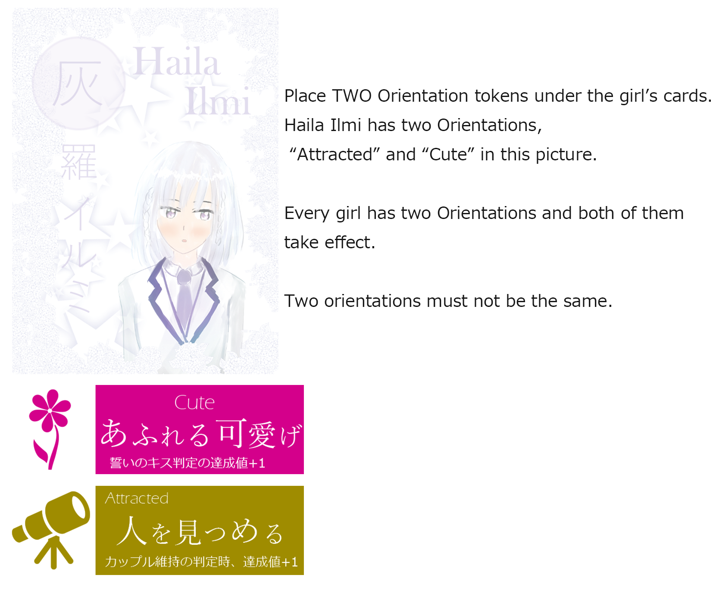

# Yuri-Kure "Utsuroi" rule book

## Overview

Yuri-Kure "Utsuroi" is an expansion set of Yuri-Kure. This expansion adds the following elements to Yuri-Kure.

- Orientation of the girls. Each girl has special attributes taking effect in the game.
- Two additional girls for a five player game. There are nine girls in a five player game.

This expansion also provides supplementary components for convenience.

## Component list

- Rule book (this paper)
- Orientation tokens (8 kinds / 3 tokens for each Orientation)
- Two girl tokens and cards
- Current action display marker
- Vote tokens
- Additional rule summary (same as provided in the basic set)
- Couple Marker (same as provided in the basic set)

## The rule about Orientation

When you play with "Orientation", add the following rules to the Yuri-Kure basic rules.

### Setup

Assign Orientations to each girl in the Setup Phase. Girls will each have TWO Orientations. One kind of Orientation cannot be held by more than three girls. For example, there is no game where four girls have the Cute Orientation.

When using the standard rules, assign Orientations as specified in this rule book. The list of Orientations is shown in "List of Orientations and effects" section. Girl's Orientations are also described on the back of her card.

When using the advanced rules, Orientations are assigned in a way agreed by the players. This could include random assignment, discussion, or any other method.

### Additional phase: Game Start Phase

After setup before the 1st turn begins, play the Game Start Phase. Players have a chance to reveal their Control Points in this phase. Like revealing in the Action Phase, reveal Control Points to each girl in the Action Order.

When the reveal step is finished for a girl having the "Cool" Orientation, the player with control declares a target girl to increase the Favor level with by 3. If other players have more hidden Control Points over the girl, players may interrupt to reveal their Control Points to change the target girl.

When all Control Point reveal steps have ended, advance to the 1st turn Action Phase. The game will progress in the same way as the basic game after this phase.



### Changes to Support Points

Additional Support Points will be added in a game with Orientation.

- +3 additional Support Points after the 3rd turn (+1 -> +3)
- +5 additional Support Points after the 6th turn (+3 -> +5)

Important change from the basic game: **Assigning Support Points to a pair multiple times in setup is forbidden.** This only restricts assignment in the Setup Phase. **Players can assign additional Support Points in any combination, including duplicated assignment.**

```plaintext
During setup: you cannot assign "5 to Akane-Shirakaba, 4 to Akane-Shirakaba, 3 to Midorino-Tsuge, 2 to Midorino-Sorai, 1 to Murafuji-Tsuge" (Akane-Shirakaba is duplicated)

When you assign "5 to Akane-Shirakaba, 4 to Sorai-Shirakaba, 3 to Midorino-Tsuge, 2 to Midorino-Sorai, 1 to Murafuji-Tsuge" during setup, you can assign "2 to Sorai-Shirakaba, 1 to Midorino-Tsuge" at the end of the 3rd turn.
```

At the end of the game, the player who assigned the most Support Points to the Fated Couple / Yuri Polygamy group is the winner. Additional Support Points are also included in winner determination.

## List of Orientations and Effects

The Orientation token has simplified Japanese text about the effect. The following list is formal effect text. If you cannot read the text on the tokens, use this list.

- Aggressive - 大胆な告白 held by: Akane, Sorai
  - When a girl with Aggressive performs a Confession and the target girl chooses "No", the resulting dice roll is treated as if they have +2 extra Favor level.

- Attracting - 惑わす魅力 held by: Shirakaba, Akane, Kuroki
  - In the Couples Phase, a Girl Pair including a girl with Attracting becomes a couple at Favor level 5 (this usually requires Favor level 6.) The max Favor level is still 6. Attracting does not have a duplicated effect even if both girls of a pair have Attracting.

- Cool - 怜悧な美人 held by: Sorai, Momozono
  - A player taking control over this girl during the Game Start Phase chooses a pair with this girl and increases the Favor level by 3.

- Passive - held by: Murafuji, Midorino
  - When a girl with Passive is a target of Confession, raise the Favor level by 1 with the confessing girl immediately. After Favor level increases, proceed with the normal process of Confession. (Favor level increases by 1 whether the girl chooses "Yes" or "No". If this girl chooses "No" and a couple did not form, increase the Favor level by 1 again.)

- Shy - 人見知り held by: Shirakaba, Midorino
  - When a girl with Shy is a target of Approach and the Favor level between them and the approaching girl is 0, Favor level will increase by 3 instead of 1.

- Friendly - みんななかよし？ held by: Tsuge, Murafuji
  - During a Game of Love, the vote of a girl with Friendly counts as 3 votes (all for the same choice, these votes cannot split.)

- Cute - あふれる可愛げ held by: Kuroki, Haila, Momozono
  - During a Kiss of Promise, add 1 to the dice roll result for each girl with Cute.

- Attracted - 人を見つめる held by: Haila, Tsuge
  - During the Couples Phase, for each girl in the couple with Attracted, treat the Discomfort level as being 1 point lower during the dice roll only. (Minimum Discomfort of 0. Attracted does not affect breaking up at Discomfort level 6.)

```plaintext
Examples to resolve effects:

Akane (Aggressive/Attracting) confesses to Murafuji (Friendly/Passive) when the Favor level is 1. Murafuji has Passive so Favor level between Akane-Murafuji increases by 1 to become 2 when Akane's action is agreed to be a Confession to Murafuji. Mufauji chooses "No", then play proceeds to the dice roll. The result is 4. Usually, a result of 4 will not make them a couple because 4 is higher than their Favor level 2. But Akane has Aggressive so the Favor level is treated as 4 in this Confession. The dice result of 4 is less than or equal to the pseudo Favor level, so Akane and Murafuji become a couple.

The Favor level between Sorai and Midorino is 1 at the end of setup. Player A takes control of Sorai during the Game Start Phase. Sorai has Cool, so Player A chooses to raise Favor level between Sorai and Midorino. Now the Favor level between Sorai and Midorino is 4 at the beginning of the 1st turn.

Haila and Momozono are a couple with Favor level 2 and Discomfort level 3. The dice result to determine break up was 3 in the Couples Phase. They will usually break up because a dice result of 3 is less than or equal to the Discomfort level, but Haila has Attracted to reduce the effective Discomfort level by 1 to treat it as 2. So they do not break up and Discomfort level increases to 4. After this dice result in Kiss of Promise is 4. Usually, they will fail because (dice result 4) + (Favor level 2) - (Discomfort level 4) = 2 and this value is less than 4. But Haila and Momozono both have Cute to gain a bonus in Kiss or Promise and the final value becomes 4. Therefore, they succeed in the Kiss of Promise.

Tsuge declares a Game of Love with the Murafuji-Momozono pair. Tsuge declared the Game of Love, and has Friendly. So she votes "Yes" 3 times. Murafuji also has Friendly but she is a part of target pair so she cannot use the effect of Friendly. One of the other girls votes "Yes" and three vote "No". As a result, 4 votes to "Yes" and 3 votes to "No" cause the Game of Love to pass.
```

## About five players game

When you play with five players, add Haila Ilmi and Momozono Renge to make a nine girl game. Rules in a five player game are the same as with a three or four player game, except the number of girls.

## Introduction of Point calc app

A point calculating web app is provided at the following URL. This app works best on mobile devices (Android is recommended.)
　<https://yurikure.wr-inst.org/app>

## Credit

### Game designer

tackman / 世界革命研究所

### Special thanks

off-boxの皆さん　らっきょ　遊弋　風見白老人　土井ヴぃ　とろろん

### Production and sale supported by
王道エンターテイメント

### Copyright notice

This product uses the following assets under an MIT license.

<https://www.iconfinder.com/icons/211620/arrow_b_right_icon>

## Info

2018/8 初版発行

contact：　tackman@tackman.info

「百合紅」Web　<https://yurikure.wr-inst.org/>