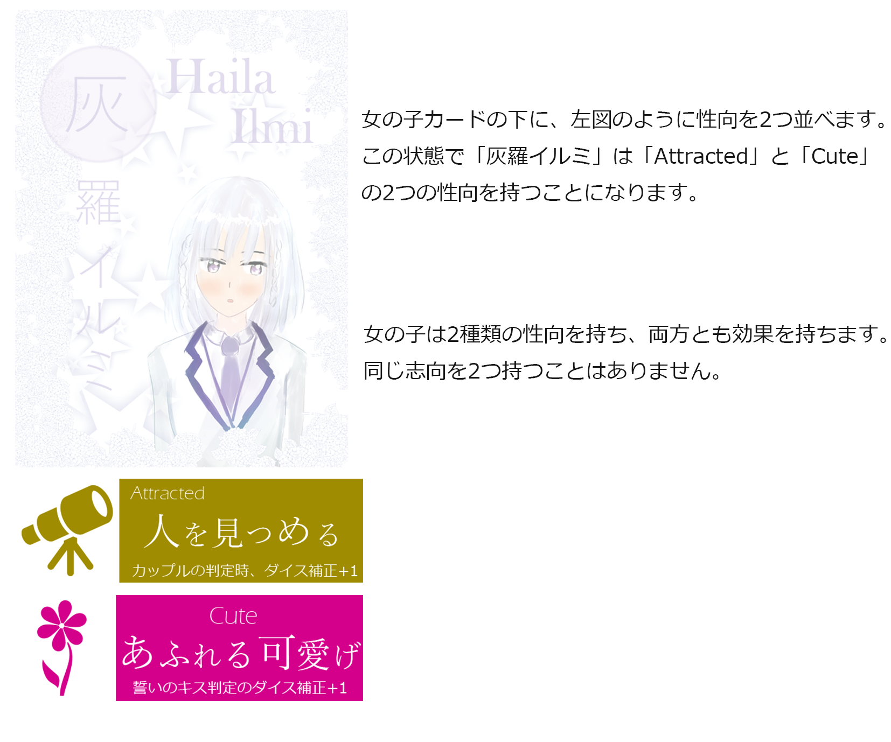

# 百合紅「うつろひ」説明書

## 概要

百合紅「うつろひ」は、「百合紅-ゆりくれ-」の拡張セットです。この拡張では、ゲーム内容として以下の要素を「百合紅」に追加します。

- 女の子ごとの性向。各女の子は、ゲーム中に効果を発揮する特性を2つずつ持ちます
- 5人戦向けの追加の女の子2人。5人戦では、女の子が9人でプレイをします

また、プレイを補助するためのコンポーネントを追加しています。

## 内容物

- 説明書（本紙）
- 性向トークン　8種 各3個
- 女の子トークンとカード　2人分
- アクション位置マーカー
- 投票トークン
- サマリー
- カップルマーカー
  - サマリーとカップルマーカーは基本セットのものと同じです

## 性向追加のルール

女の子の性向を導入する場合、「百合紅」基本ルールに以下の追加を行います。

### セットアップ

セットアップ時に、女の子ごとに性向の割り振りをします。女の子には2種類ずつの性向を付与します。1種類の性向は、ゲーム中最大3人まで所持できます。(例えば、「Cute」を持つ女の子が4人いることはありません)

標準ルールでは、各女の子ごとに指定された性向を割り振ります。女の子ごとの性向の指定は「性向の一覧と効果」の内容になっています（基本セット第2版以降は、女の子カードの裏面にも記述されています）。

アドバンストルールでは、性向のランダム付与や各プレイヤーが納得する内容で性向付与をします。

### ゲーム開始フェーズの追加

セットアップ終了後、1ターン目が始まる前に「ゲーム開始フェーズ」を行います。このフェーズでは、女の子のアクション順にコントロール点の公開ステップを行います。「Cool - 怜悧な美人」を持つ女の子へのコントロール点公開が終了した時、コントロールを得ているプレイヤーは好感度+3をする相手の女の子を宣言します。これに対して、他のプレイヤーが割り込みでコントロール点を公開して「Cool - 怜悧な美人」の対象を変更させることも可能です。

全ての女の子に対するコントロール点公開が終了したら、1ターン目のアクションフェーズへ移ります。



### 支援点について

性向導入時は、追加の支援点は下記となります。

- 3ターン終了時の追加支援点は3点
- 6ターン終了時の追加支援点は5点

また、セットアップ時の支援点割り振りで **同一の女の子組に対して重複して支援点を割り振るのは禁止** されます。**追加の支援点は任意の組み合わせで割り振ることができます。** 追加の支援点は、重複をしてもかまいません。

```plaintext
セットアップ時に、「赤白5点・赤白4点・緑黄3点・緑空2点・紫黄1点」のように支援点を割り振ってはいけません（赤白が重複）。

セットアップ時に「赤白5点・空白4点・緑黄3点・緑空2点・紫黄1点」で支援点を振っていた状態で、3ターン目の追加支援点を「空白2点・緑黄1点」のように振るのは可能です。
```

ゲーム終了時の勝敗判定では、運命のカップル・百合重婚の女の子組に割り振った支援点の単純合計が一番高いプレイヤーの勝利となります。

```plaintext
セットアップ時の支援点の重複割り振りの禁止は、基本版からのルール変更点となります。この変更の結果、誓いのキスによる運命のカップル誕生でゲームが終了した場合、勝敗判定の支援点の計算は単純な合計になりました。
```

## 性向の一覧と効果

性向トークンには簡易説明がついていますが、正規の効果文は以下の内容となります。トークンの簡易説明で処理が分からない場合は、下記の記述を参照してください。

- Aggressive - 大胆な告白 所持：赤 空
  - この性向を持つ女の子が告白をして断られた時のカップル成立のダイス判定時に、好感度が+2されているとみなして判定をする

- Attracting - 惑わす魅力 所持：白 赤 黒
  - カップルのフェーズで、この性向を持つ女の子を含む女の子組は好感度5でカップルになる（好感度上限は6のまま/Attractingの重複なし）

- Cool - 怜悧な美人 所持：空 桃
  - ゲーム開始フェーズにこの性向を持つ女の子のコントロールを得たプレイヤーは、その女の子と他の女の子1人との好感度を+3する。

- Passive - 告白待ち 所持：紫 緑
  - この性向を持つ女の子が告白された時、告白をした女の子との間の好感度をその時点+1する。その後、通常の告白を受けた場合の処理の移る。(告白をされた場合、断っても断らなくても好感度+1。断った上でカップル非成立の場合、さらに好感度+1)

- Shy - 人見知り 所持：白 緑
  - この性向を持つ女の子が好感度0の女の子からアプローチされた時、好感度は+1のかわりに+3される

- Friendly - みんななかよし？ 所持：黄 紫
  - この性向を持つ女の子は、「駆け引き」で投票する時に3票分を持つ(投票先は1つで、票の分割はできない)

- Cute - あふれる可愛げ 所持：黒 灰 桃
  - この性向を持つ女の子を含むカップルは、誓いのキス判定の達成値に+1をする

- Attracted - 人を見つめる 所持：灰 黄
  - この性向を持つ女の子を含むカップルは、カップルのフェーズで別れる判定のダイスをする時に、不満度が-1されているとみなして判定をする。（不満度6で別れる処理には影響しない）

```plaintext
効果解決の例：

赤(Aggressive / Attracting)が紫(Friendly / Passive)に対して、好感度1の状態で告白を行った。紫がPassiveを持っているので、赤のアクションが紫への告白だと確定した時点で好感度が+1されて好感度が2になる。紫は告白を断ったので、カップル成立判定のダイスロールに入る。ダイスの出目は4だった。通常は好感度2より高い出目なのでカップルにはならないが、赤はAggressiveを持っているのでこの判定中は好感度4とみなされ、ダイス目が4なので赤紫はカップルになる。

白と黒の好感度が0の状態で、黒が白にアプローチをかけた。白はShyを持っているので、アプローチ後の好感度は1ではなく3になる。

セットアップ完了時点で、空と緑の好感度が1だった。ゲーム開始フェーズで、プレイヤーAは空のコントロールを得た。空はCoolを持っているので、プレイヤーAは空と緑の好感度を上げて1ターン目開始時点で空緑の好感度は4で始まる。

灰と桃が好感度2、不満度3のカップルだった。カップルが別れるかの判定で、ダイスは3が出た。通常は不満度以下の出目なので別れるが、灰がAttractedを持っているのでこの判定中は不満度は2とみなされ、カップルは別れず不満度が+1されて不満度3になった。その後、誓いのキスの判定でダイス出目は4が出た。通常は出目4 + 好感度2 - 不満度4 = 2で、達成値が4に満たないため誓いのキスは失敗となるところ、灰と桃はそれぞれCuteを持っているので達成値は合計+2される。結果、達成値は4になり誓いのキスは成功した。

黄が紫と桃の組に対して「駆け引き」を行った。駆け引きを開始した女の子なので、黄色はFriendlyの効果で賛成に3票分を投じた。紫は駆け引きをされる組に入っているのでFriendlyの効果は使われない。残り4人の女の子のうち、1人が賛成・3人が反対した結果、賛成4票反対3票で駆け引きは賛成多数で成立となる。
```

## 5人戦について

5人プレイ時は、本拡張で追加された「灰羅イルミ」「桃園蓮華」を追加し、女の子が9人でゲームをします。女の子の数の他は、3-4人戦と変わりません。

## 点数計算アプリの紹介

紙の支援点記入シートの他に、PC・スマホで入力可能な点数計算アプリを提供予定です(下記URL)

　<https://yurikure.wr-inst.org/app>

## クレジット

### ゲームデザイン・制作

tackman / 世界革命研究所

### 協力

off-boxの皆さん　らっきょ　遊弋　風見白老人　土井ヴぃ　とろろん

### 製造・販売サポート

王道エンターテイメント

### Copyrihgt notice

This product uses following assets under MIT license.

<https://www.iconfinder.com/icons/211620/arrow_b_right_icon>

## 奥付

2018/8 初版発行

連絡先：　tackman@tackman.info

「百合紅」Web　<https://yurikure.wr-inst.org/>