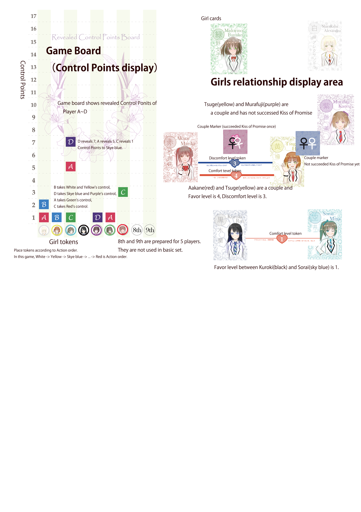

# Yuri-Kure rule book

## Story

You will be an "Atmosphere" to introduce girls and couple your disired girls.
Girls are first grade in a school. Watch the changing relations in 9 terms.

## Game overview

In Yuri-Kure, you pursuit that desired Girls Pair will be the Fatal couple.
Players assign Support Point to their desired Girls Pair in secret.
Each player's Control Point of every girl will be introduced by assigned Support Point.
You can gain control of girl's Action by **exposing your control points**.
When your desired Girls Pair becomes Fatal couple, you are next to victory.
Or Yuri Polygamy with three or more girls may also bring victory for players unsatisfied by a single girl-girl pair.

## Components



## Setup

## Settle initial couple and initial Favors

Settle following state of girls pair at random by any way, as such drawing two girl tokens.

At the beginning of game...

1. A girls pair being a Couple
   - Place a couple marker between coupled girls. "Before Kiss of Promise" side (blue one) should be shown here.
1. A girls pair with Favor Level 2
1. Two girls pairs with Favor Level 1

Note:

- Girls pair of 2 and 3 must be other pairs. No girls pair starting with Favor Level 3 or 4 by overlapping 2 and 3. And no game starting with two girls pairs having Favor Level 2.
- 1 and (2 or 3) can be overlapped.

## Generate girls action order

1st ~ 7th on the game board shows girls action order. Settle action order also at random any way, by placing girls token faced-down for example.

## Deciding players' Support Point

Players write their Support Points to Support Point Sheet **after initial game state is settled. You can refer initial game state when you decide Support Point.**

### About Support Point assignment

Each player chose five any girls pairs in secret, then write down each different 1 ~ 5 point values to the five girls pairs.
These values are Support Points. Each value expresses how the player pushes a girls pair with assigned value.
Higher value means the player pushes higher rate.
You must not use same value more than one times, then total Support Point is always 15.

All Support Points decided here will be hidden until the game ends.

### Calculating Control Points

Each players have their Control Points over every girl (Not a girls pair. Control Points exists per girl).
You have possibility to control girl's Action by your Control Points.
Control Points' values are introduced from each player's Support Point automatically.
These values are calculated by following rule:

#### Any girl's control point = Sum of Support Points' values where girls pair(s) including the girl

```plaintext
Example:
Player A assigned his support points to "Aakane / Shirakaba" by 3, "Shirakaba / Kuroki" by 2.
Here,
Control Point of Akane = 3
Control Point of Shirakaba = 3 + 2 = 5
Control Point of Kuroki = 2
```

```plaintext
You can declare you have Control Point to a girl in Action Phase (described below). About Exposure of Control Point is explained in Turns and Action Phases.
```

### Additional Support Points

Players gain additional Support Points in following times.

- 1 additional point at the end of 3rd turn
- 3 additional point at the end of 6th turn

You can assign these points to any girls pairs as additional points, without any constraint as such you assigned to a girls pair in setup or not.
You may assign 6th turn' additional points one by one. In other words, you can do all following assignment:
3 points to a girls pair, 2 points to a girls pair and 1 point to a girls pair, 1 points to three different girls pair.
**After Support Points added, Control Points also raises according to assigned Support Points.**

## Turns

"Turn" is a cycle of game progress. A turn contains following three phases.

1. Action phase

   - Girls do "Action (described below)" by action order in this phase.
   - All interventions from players to girls are done in this phase.

1. Couple's phase

   - Processing occurrence about couples.

1. Kiss of Promise phase
   - Coupled girls pair try to kiss for promise here. Game end condition is also checked in this phase.

When game end condition is satisfied in "Kiss of Promise phase", the turn ends **immediately** and proceeds to winner determination.

```plaintext
Immediate turn end may affect when Fatal couple and Yuri Polygamy are satisifed in same time.
```

Game longs 9 turns in max. When 9th turn ends the game proceeds to winner determination.

## Action phase

Each girl's action is determined in Action phase. Players can reveal their partial or all Control Point to choose girl's action.
Girl's actions are determined in order of Action order. Action order is settled in setup.
Action is one of these: "Approach", "Confession", "Game of Love", "Nothing".

### Reveal of Control Points

Players may reveal _partial_ or all control point about a target girl to gain control.
You can reveal only equal or less value of your Control Point.
You can reveal your control in any timing in Action phase.
When you reveal your control point to a girl whose control has already been taken by other player, you need reveal more (NOT EQUAL) control point.

Example: Player A has 7 Control Point over Murafuji. Nobody has revealed control point to Murafuji, so Player A revealed 1 Control Point to Murafuji and declared Murafuji will do Approach to Kuroki.
Here, before the action is determined Player B interrupted to reveal 2 Control Point to Murafuji then declared her action will be Confession to Midorino.
Player A has more (hidden) control point over Murafuji, so he revealed 4 Control Point to Murafuji and declared Approach to Kuroki again.
No other player revealed higher Control Point about Murafuji, therefore Murafji's action is determined to Approach to Kuroki.

```plaintext
Above is simplified rule about revealing Control Points. More strict (but complex) rule is provided in our web site. Applying strict rule is recommended if all players are expert.
```

### Actions

#### Approach

Approach raises Favor level between approaching girl and approached girl.
Approach action is declared with target (approached) girl. Raise Favor level by 1 to the pair.

If approaching / approached girl is a part of coupled girls, and approaching to a girl other than the coupled girl / approached by a girl other than the coupled girl, raise Discomfort level by 1 to the pair(s).

Favor level and Discomfort level are counted separately. For example, when Discomfort level raises to a pair having Favor level 4, Favor level will NOT be decrease to 3, but the pair will have BOTH Favor level 4 and Discomfort level 1.

Favor levels and Discomfort levels are expressed by Favor/Discomfort tokens bridged between girls.

#### Confession

Girl and girl becomes a couple in this action. **Only girl who is not a Couple to any other girl can do Confession.**
Confession is declared with a target girl.

1. Confessed girl chooses "OK" to become a couple or "No". When a target girl chooses OK, confessing and confessed girls pair becomes a Couple then the action ends.

   - Confessed girl's choice is decided by the player who has control over confessed girl. Other players may interrupt to change girl's choice by revealing their Control Point.
   - If no player reveals Control Point to confessed girl, the girl will choose No.

1. When confessed girl chooses No, result is determined by roll of die.
   - If rolled number is less or equal to Favor level, these girls pair will be a couple (even though the confessed girl said No.)
   - If rolled number is greater than Favor level, they will not be a couple and raise 1 Favor level between confessing / confessed girl.

Whether confessed girl chooses OK or No, every girls pair of existing couple other than confessing / confessed girls pair raises 1 Discomfort level if a new couple is formed.

A newly formed couple is displayed by Couple marker's "Before Kiss of Promise" blue side.
Even if a newly formed couple was once a couple with same girls pair before, they will start from "Before Kiss of Promise" again.

```plaintext
A girl who is already a part of couple may be confessed from other girls. This may cause so-called two-timing.
```

#### Game of Love

This action is a game of love, played by girls. You need to declare Game of Love with target girls "pair". The target girls must not form a couple
(it does not matter whether a girl of the target girls pair forms couple to other girl(s)).
The target girls pair will be voted whether they should be a couple or not by other girls.

1. Other girls vote "Agree" or "Disagree" to the target girls pair.
   - Choice of vote is decided by the player who has control over the girl.
   - When a girl is not taken control by any player, she will vote to Disagree.
   - The girl who did Game of Love action here automatically vote to Agree.

Determinate girls voting in order of Action order. A next action order girl of the girl started Game of Love action votes first.
When the last action order's girl votes, voting continues to 1st girl and all girls except voted girls will vote.

- Majority agree votes causes following effect. If Disagree is majority, nothing will happen.
  1. Each target girl chooses they will be a couple or not. Choice is done in Action order.
  1. If BOTH target girls chose OK to become a new couple, they will be a couple and causes same effects as formed couple in Confession.
  1. If ONE OF target girls chose No to become a new couple, Discomfort level raises by 1 between these girls pair.

#### Do nothing

A girl ends action with no effect. If no player reveals Control Point to a girl, she will automatically choose Do Nothing.

When all girls end action, proceed to next phase.

## Couple's phase

Roll dice to every couple. Effect is determined by score of "(Die number) - (Discomfort level)".

- 0 or less: The couple breaks up (the girls pair will become not-a-couple state)
- 1 ~ 2: Raise Discomfort level by 1
- 3 or more: No effect
- If die number is 6, do nothing above and raise Favor level by 1 (imagine critical).

```plaintext
Die number 6 is exceptional case, not affected by score of "(Die number) - (Discomfort level)".
```

After above process, couples with Discomfort level 6 breaks up. Broken up girls pair's Favor and Discomfort level is reset to 0.

Then each girls pair with Favor level 6 becomes a couple. This "natural forming" will not cause any raise of Discomfort level.

## Kiss of Promise phase and victory condition

Roll die to every couple to successes Kiss of Promise or not. They will success when "(Die number) + (Favor level) - (Discomfort level)" is 4 or more.

Initial couple (determined in setup) does not try it in 1st turn.

A succeeded couple becomes "first time succeeded" state (expressed by red side of Couple marker). A failed couple becomes "Not succeeded" state (expressed by blue side of Couple marker).
If a "first time succeeded" couple failed Kiss of Promise, the state will back to "Not succeeded".

If "first time succeeded" couple succeeded Kiss of Promise again in this turn, the couple will be Fatal Couple and the game ends.
When multiple couples exists, all roll dice about Kiss of Promise are treated as same time. It means multiple Fatal Couples may be born in one game.

```plaintext
Fatal couple needs to succeed Kiss of Promise in continuous 2 turns. Success, failure and then success cannot introduce to Fatal Couple.
```

When Fatal Couple is born, winner is determined by sum of Support Point to Fatal Couple(s).
If sum of Support Point tie-breaks, a player who revealed **LESS** Control Points about Fatal Couple(s) is winner.
If revealed Control Points are also same, the game is draw.

```plaintext
Example: Shirakaba and Midorino became a Fatal Couple. Player A and Player B both assigned 4 Support Points to Shirakaba-Midorino and they were max in the game.
Player A has revealed 3 Control Point to Shirakaba and 4 Control Point to Midorino.
Player B has revealed 1 Control Point to Shirakaba and 5 Control Point to Midorino.
Sum of revealed Control Points is; A is 7, B is 6. It results winner is B.
```

## Yuri Polygamy to end game

When no Fatal Couple is born in Kiss of Promise phase, check Yuri Polygamy is formed or not. Yuri Polygamy means "In 3 ore more girls group, all girls pair in group is couple".

```plaintext
Example 1: When Akane and Shirakaba, Shirakaba and Kuroki, Kuroki and Akane are couples, Akane-Shirakaba-Kuroki's Yuri Polygamy is formed.
Example 2: When Sorai and Midorino, Midorino and Tsuge are couples and Sorai and Tsuge is not a couple, Sorai-Midorino-Tsuge is not a Yuri Polygamy.
Example 3: Murafuji and Akane, Murafuji and Kuroki, Murafuji and Shirakaba, Akane and Kuroki, Akane and Shirakaba, Kuroki and Shirakaba are couples, Murafuji-Akane-Kuroki-Shirakaba forms Yuri Polygamy.

Note that already-coupled girl cannot confess to any other girl. Yuri Polygamy cannot be formed only by Confessions.
```

When Yuri Polygamy is formed, the game ends and proceed to determinate winner. Winner is determined by sum of Support Points assigned to girls pairs included in Yuri Polygamy group.
Tie-break is also determined by revealed Control Points same as Fatal Couple's case. Less revealed player is winner.

## Game end by 9th turn

When both Fatal Couple and Yuri Polygamy is not born at the end of 9th turn, winner is determined by existing couple(s). Count Support Points (and Control Points to tie-break) same as Fatal Couple's case.

## Misc rules

- Max Favor / Discomfort level is 6.
- Favor level token or other components may short, actual game should not be affected by constraint from physical components.

## FAQ

- In 1st turn, another girls pair (not an initial couple settled in Setup) became a couple. Does this couple try Kiss of Promise in 1st turn?

  - Yes, they try. Only initial couple formed at Setup does not try Kiss of Promise in 1st turn. The initial couple also tries Kiss of Promise like other couples after 2nd turn.
