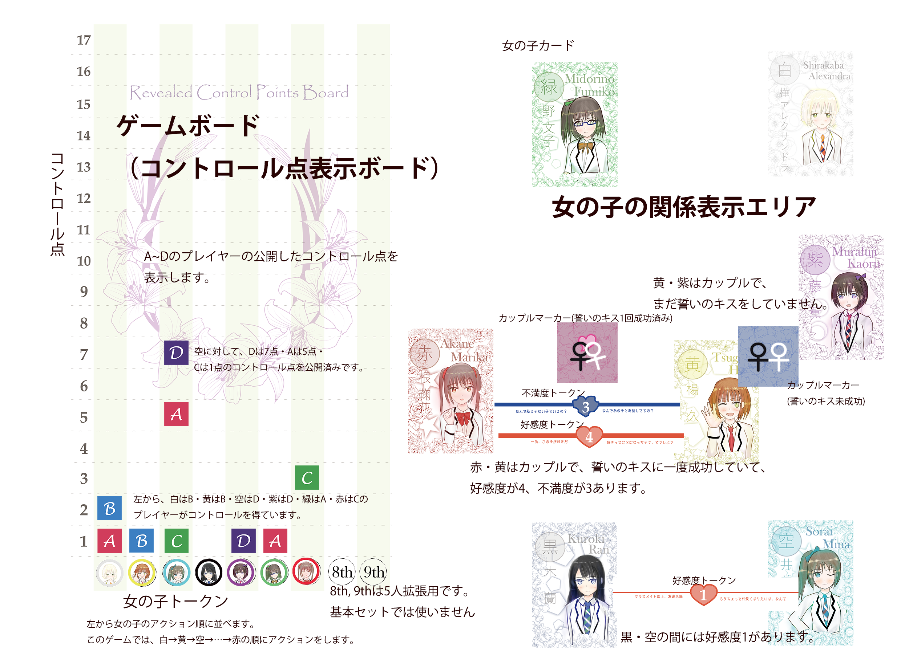

# Yuri-Kure rule book

## Story

You will be an "Atmosphere" to introduce girls and couple your disired girls.
Girls are first grade in a school. Watch the changing relations in 9 terms.

「百合紅 ( ゆりくれ )」は女の子を導く空気存在になって、プレイヤーの望むカップルを誕生させるゲームです。
女の子たちは、ある学園に入学した 1 年生。9 つの学期を過ごす間に、変化していく人間関係を見守りましょう。

## Game overview

In Yuri-Kure, you pursuit that desired Girls Pair will be the Fatal couple.
Players assign Support Point to their desired Girls Pair in secret.
Each player's Control Point of every gril will be introduced by assigned Support Point.
You can gain control of girl's Action by **exposing your control points**.
When your desired Girls Pair becomes Fatal couple, you are next to victory.
Or Yuri Bigamy wiht three or more girls may also bring victory for players unsatisfied by a single girl-girl pair.

「百合紅」は推したい女の子の 2 人組(女の子組)がカップルになることを目指すゲームです。
プレイヤーは、ゲーム開始時に他のプレイヤーに内緒で推しの女の子組に「支援点」を割り振ります。支援点にもとづいて、1 人 1 人の女の子の「コントロール点」が決定されます。プレイヤーはコントロール点を **公開**することで、女の子の「アクション」を決定する権利を得ます。 自分の推している女の子組が「誓いのキス」を 2 回連続で成功させ「運命のカップル」となった時、あなたの勝利は目前でしょう。あるいは、1 人を選ぶことなんて出来ない！という場合には「百合重婚」で 3 人以上の交際エンドで勝利も可能です。

## Components



# Setup

## Settle initial couple and initial Favors

Settle following state of girls pair at random by any way, as such drawing two girl tokens.

At the beggining of game...

1. A girls pair being a Couple
   - Place a couple marker between coupled girls. "Before Kiss of Promise" side (blue one) should be shown here.
1. A girls pair with Favor Level 2
1. Two girls pairs with Favor Level 1

Note:

- Girls pair of 2 and 3 must be other pairs. No girls pair starting with Favor Level 3 or 4 by overlapping 2 and 3. And no game starting with two girls pairs having Favor Level 2.
- 1 and (2 or 3) can be overlapped.

女の子チップをランダムに 2 枚引くなどの方法で、ゲーム開始時点から以下の状態の女の子組を決めます。

ゲーム開始時点で…

1. カップルになっている女の子組　 1 組
   - カップルの女の子組の間には、カップルマーカーを「誓いのキス前」の面(青い面)を表にして置いてください。
1. 好感度 2 の女の子組　 1 組
1. 好感度 1 の女の子組　 2 組

- 2 と 3 の女の子組は別々でなければなりません。（2 と 3 を重複し、ゲーム開始時点で好感度が 3 や 4 になる女の子組はありません。また、3 が重複し好感度 2 の女の子組が 2 組になることもありません。）
- 1 と 2・3 は重複可能です。

## Generate girls action order

1st ~ 7th on the game board shows girls action order. Settle action order also at random any way, by placing girls token faced-down for example.

ゲームボード上の 1st ～ 7th は、女の子のアクション順を表します。アクション順も、女の子チップを裏向けで並べるなどの方法でランダムに決定します。

## Deciding players' Support Point

Players write their Support Points to Support Point Sheet **after initial game state is settled. You can refer initial game state when you decide Support Point.**

**上記の初期状態が決定した後、初期状態を参照した上で**各プレイヤーは支援点シートに支援点を記入します。

### About Support Point assignment

Each player chose five any girls pairs in secret, then write down each different 1 ~ 5 point values to the five girls pairs.
These values are Support Points. Each value expresses how the player pushes a girls pair with assigned value.
Higher value means the player pushes higher rate.
You must not use same value more than one times, then total Support Point is always 15.

All Support Points decided here will be hidden until the game ends.

プレイヤーはそれぞれ、自分が推したい任意の女の子の組を秘密裏に 5 組選び、この 5 組に 1 ～ 5 の異なる数字を書き込みます。
この数値を支援点と呼び、プレイヤーがそのカップルをどれだけ推しているかを表現しています。
数値が高いほど、そのプレイヤーはそのカップルを推していることになります。
同じ数値を複数回使ってはならず、支援点の合計は常に 15 になります。

アドバンストルールとして、支援点を入れる女の子組を重複可能にするルールでプレイすることも可能です。

```
初めてのプレイの場合、支援点を設定する女の子組は重複不可のルールでプレイするのが良いでしょう。
```

ここで記入したプレイヤーごとの支援点は、ゲーム終了時まで秘密となります。

### Calculating Control Points

Each players have their Control Points over every girl (Not a girls pair. Control Points exists per girl).
You have possibility to control girl's Action by your Control Points.
Control Points' values are introduced from each player's Support Point automatically.
These values are calculated by following rule:

_Any girl's control point = Sum of Support Points' values where gilrs pair(s) including the girl_

```
Example:
Player A assigned his support points to "Aakane / Shirakaba" by 3, "Shirakaba / Kuroki" by 2.
Here,
Control Point of Akane = 3
Control Point of Shirakaba = 3 + 2 = 5
Control Point of Kuroki = 2
```

```
You can declare you have Control Point to a girl in Action Phase (described below). About Exposure of Control Point is explained in Turns and Action Phases.
```

プレイヤーは自身の支援点にもとづき、それぞれの女の子のコントロール点を算出します。コントロール点は、ゲーム中、女の子の行動をコントロールするために使用するものです。この点数は、各プレイヤーが割り振った支援点から以下の方法で算出されます。

_ある女の子のコントロール点 ＝ 支援点が入っている女の子組で、その片方の女の子の時の支援点の合計_

```
例：プレイヤーAが「赤・白」に支援点3点、「白・黒」に支援点2点を配分したとします。この場合、
赤のコントロール点＝3点
白のコントロール点＝3+2＝5点
黒のコントロール点＝2点
となります。
```

```
プレイヤーは後述のアクションフェーズ中に、特定の女の子に対して自分がコントロール点を持っていることを宣言できます。コントロール点の公開に関しては、ターン進行・アクションフェーズの項で説明されています。
```

### Additional Support Points

Players gain additional Support Points in following times.

- 1 additional point at the end of 3rd turn
- 3 additional point at the end of 6th turn

You can assign these points to any girls pairs as additional points, without any constraint as such you assigned to a girls pair in setup or not.
You may assign 6th turn' additional points one by one. In other words, you can do all following assignment:
3 points to a girls pair, 2 points to a girls pair and 1 point to a girls pair, 1 points to three different girls pair.
**After Support Points added, Control Points also raises according to assigned Support Points.**

ゲーム中、特定のタイミングで追加の支援点を設定可能です。任意の女の子組へ、

- 3 ターン目終了時に 1 点
- 6 ターン目終了時に合計 3 点

の支援点を追加できます。追加の支援点は、セットアップ時に支援点を割り振った女の子組か否かに関係なく割り振れます。また、6 ターン目の追加支援点は 1 点ずつ指定可能です。つまり、同じ女の子組に 3 点を振る・2 つの女の子組に 2 点・1 点で割り振る・3 つの女の子組に 1 点ずつ割り振る、のいずれも可能です。**追加の支援点が割り振られた後、コントロール点も支援点に応じて上昇します。**

# Turns

"Turn" is a cycle of game progress. A turn contains following three phases.

1. Action phase

   - Girls do "Action (described below)" by action order in this phase.
   - All interventions from players to girls are done in this phase.

1. Couple's phase

   - Processing occurrence about couples.

1. Kiss of Promise phase
   - Coupled girls pair try to kiss for promise here. Game end condition is also checked in this phase.

When game end condition is satisfied in "Kiss of Promise phase", the turn ends **immediately** and proceeds to winner determination.

```
Immediate turn end may affect when Fatal couple and Yuri Bigamy are satisifed in same time.
```

Game longs 9 turns in max. When 9th turn ends the game proceeds to winner determination.

「ターン」はゲームの進行する単位です。1 つのターンは、以下の 3 つのフェーズに分かれています。

1. アクションフェーズ
   - 女の子が順番に「アクション」(後述)をするフェーズです。
   - プレイヤーから女の子への干渉は、全てこのフェーズ内で行われます。
1. カップルのフェーズ
   - カップルの女の子組に関して処理をするフェーズです。
1. 誓いのキスフェーズ
   - カップルの女の子組が、誓いのキスに成功するかを判定するフェーズです。また、ゲームの終了条件のチェックも行われます。

「誓いのキスフェーズ」でゲームの終了条件が満たされた場合、**その時点で**ターンは終了し勝敗判定へ移行します。

```
ゲームの終了条件が満たされた場合、同じターン中でも以降の処理は行われません。これは誓いのキスと、百合重婚が同時に成立する場合に影響があります。
```

ゲームのターン数は最大で 9 ターンです。9 ターンが終了した時点で勝敗判定へ移行します。

## Action phase

Each girl's action is determinated in Action phase. Players can reveal their partial or all Control Point to choose girl's action.
Girl's actions are determinated in order of Action order, settled in setup.
Action is one of these: "Approach", "Confession", "Game of Love", "Nothing".

アクションフェーズでは、各女の子がこのターンに行うアクションを決定します。各プレイヤーは、コントロール点の一部もしくは全てを公開して女の子の行うアクションを決定できます。女の子のアクションは、セットアップで決まったアクション順に一人ずつ決定していきます。女の子の取れるアクションは、「アプローチ」「告白」「駆け引き」「何もしない」のどれかです。

### Reveal of Control Points

Players may reveal _partial_ or all control point about a target girl to gain control.
You can reveal only equal or less value of your Contrl Point.
You can reveal your control in any timing in Action phase.
When you reveal your control point to a girl whoes control has already been taken by other player, you need reveal more (NOT EQUAL) control point.

Example: Player A has 7 Control Point over Murafuji. Nobady has revealed control point to Murafuji, so Player A revealed 1 Control Point to Murafuji and declared Murafuji will do Approach to Kuroki.
Here, before the action is determinated Player B interrupted to reveal 2 Control Point to Murafuji then declared her action will be Confession to Midorino.
Player A has more (hidden) control point over Murafuji, so he revealed 4 Control Point to Murafuji and declared Approach to Kuroki again.
No other player revealed higher Control Point about Murafuji, therefore Murafji's action is determinated to Approach to Kuroki.

```
Above is simplified rule about revealing Control Points. More strict (but copmlex) rule is provided in our web site. Applying strict rule is recommended if all players are expert.
```

プレイヤーは、コントロール点の**一部**もしくは全てを公開して女の子のコントロールを得ることが出来ます。プレイヤーが公開できるコントロール点は、支援点にもとづいて決まった女の子ごとのコントロール点までです。コントロール点の公開は、アクションフェーズ中は任意のタイミングで行えます。他のプレイヤーが既にコントロール点を公開している女の子に対してコントロール点を公開する場合、既に公開されているコントロール点より大きいコントロール点を公開する必要があります。

例：プレイヤー A さんは、紫に対してコントロール点 7 を持っています。紫へのコントロール点を誰も公開していないので、紫のアクションのタイミングでコントロール点 1 を公開して黒へのアプローチを宣言しました。ここで、アクションが確定する前にプレイヤー B さんが割り込んでコントロール点 2 を公開して、紫のアクションを緑への告白にすると宣言しました。A さんはより高いコントロール点を持っているので、紫へのコントロール点 4 を公開して改めて黒へのアプローチを宣言しました。紫に対して A さんより高いコントロール点を公開するプレイヤーがいなかったので、紫のアクションは黒へのアプローチで確定しました。

```
上記はコントロール点公開手順に関する簡易版ルールです。より厳密なコントロール点公開のルールは、サークルWebサイトで公開しています。厳密なコントロール点公開ルールは、プレイヤーが慣れてから適用すると良いでしょう。
```

### Actions

#### Approach

Approach raises Favor level between approaching girl and approached girl.
Approach action is declared with target (approached) girl. Raise Favor level by 1 to the pair.

If approaching girl or approached girl is a part of coupled girls pair that is not a pair of approaching / approached girls, raise Discomfort level by 1 to pairs other than approaching / approached girls pair.

Favor level and Discomfort level are counted separately. For example, when Discomfort level raises to a pair which has Favor level 4, Favor level will NOT be decrease to 3, but the pair will have BOTH Favor level 4 and Discomfort level 1.

Favor levels and Discomfort levels are expressed by Favor/Discomfort tokens bridged between girls.

アプローチのアクションをした女の子と、対象の女の子の好感度が上がる行動です。アプローチのアクションは、アプローチ対象と同時に宣言します。アプローチをした女の子と、対象の女の子の間の好感度を 1 上げます。

アプローチをした女の子、もしくは対象となった女の子が、アプローチの組み合わせ以外でカップルになっている場合、各カップルの女の子組の不満度を 1 上げます。

好感度と不満度は別々に管理されます。例えば、好感度 4 の状態から不満度が 1 追加される場合は、好感度 3 にはならず好感度 4・不満度 1 の状態になります。

好感度と不満度は、好感/不満度トークンで女の子の間をつないで表現します。

#### Confession

Girl and girl becomes a couple in this action. **Only girl who is not a Couple to any other girl can do Confession.**
Confession is declared with a target girl.

1. Confessed girl chooses "OK" to become a couple or "No". When a target girl chooses OK, confessing and confessed girls pair becomes a Couple then the action ends.

   - Confessed girl's choice is decided by the player who has control over confessed girl. Other players may interrupt to change girl's choice by revealing their Control Point.
   - If no player reveals Control Point to confessed girl, the girl will choose No.

1. When confessed girl chooses No, result is determinted by roll of die.
   - If rolled number is less or equal to Favor level, these girls pair will be a couple (even though the confessed girl said No.)
   - If rolled number is greater than Favor level, they will not be a couple and raise 1 Favor level between confessing / confessed girl.

Whether confessed girl chooses OK or No, every girls pair of existing couple other than confessing / confessed girls pair raises 1 Discomfort level if a new couple is formed.

A newly formed couple is displayed by Couple marker's "Before Kiss of Promise" blue side.
Even if a newly formed couple was once a couple with same girls pair before, they will start from "Before Kiss of Promise" again.

```
A girl who is already a part of couple may be confessed from other girls. This may cause so-called two-timing.
```

女の子と女の子がカップルになるアクションです。**カップルになっていない女の子のみ、告白を行えます。**告白のアクションは、告白対象になる女の子と同時に宣言します。

1. 告白対象の女の子が OK を出すかどうかを決めます。OK を出した場合、告白をした女の子と告白対象の女の子組がカップルになり、アクションが終了します。
   - OK を出すかどうかは、告白対象の女の子のコントロールを持っているプレイヤーが決定します。この時、他のプレイヤーが割り込んでコントロール点を公開することで、女の子が OK を出すかどうかを変更してもかまいません。
   - 女の子のコントロール点を誰も公開しない場合、女の子は OK を出さなかったものとして処理します。
1. 告白対象が OK を出さなかった場合、ダイスで判定を行います。
   1. ダイスの出目が好感度以下の場合は、（OK を出さなかったけれど）この女の子組はカップルになります。
   1. ダイスの出目が好感度より大きい場合は、告白をした女の子と告白対象の女の子組の好感度を+1 します。

いずれの場合も、新しくカップルになった女の子が既に他の女の子とカップルになっていた場合、既にカップルになっている女の子組で不満度を+1 します。

新しくカップルになった女の子組は、カップルマーカーを誓いのキス前の状態(青の面)で表示します。以前にカップルで誓いのキスに成功したことがある女の子組の場合でも、誓いのキス前の状態でカップルになります。

```
既にカップルの相手がいる女の子に対して、その他の女の子が告白をすることも可能です。こうしてさらに新しいカップルが誕生した場合、いわゆる二股関係が発生します。
```

#### Game of Love

This action is a game of love played by girls. You need to declare Game of Love with target girls "pair", that does not form a couple
(it does not matter whether a girl of the target girls pair forms couple to other girl(s)).
A target girls pair will be voted whether they should be a couple or not by other girls.

1. Other girls vote "Agree" or "Disagree" to the target girls pair.
   - Choice of vote is decided by the player who has control over the girl.
   - A girl whoes control is not taken by any player will vote to Disagree.
   - The girl who did Game of Love action here automatically vote to Agree.

Determinate girls voting in order of Action order. A next action order girl of the girl started Game of Love action votes first.
When the last action order's girl votes, voting continues to 1st girl and all girls except voted girls will vote.

- Majority agree votes causes following effect. If Disagree is majority, nothing will happen.
  1.  Each target girl chooses they will be a copule or not. Choice is done in Action order.
  1.  If BOTH target girls choosed OK to bocome a new couple, they will be a couple and causes same effects as formed couple in Confession.
  1.  If ONE OF target girls choosed No to become a new couple, Discomfort level raises by 1 between these girls pair.

```
「駆け引き」は第1版と比較して、大幅な変更が入っています。
```

女の子の間で恋の駆け引きが行われるアクションです。駆け引きのアクションでは、対象とする**女の子組**を同時に宣言します。対象はカップルでない女の子組から選びます（対象の女の子組の片方が、他の女の子とカップルであるかは問いません）。対象となった女の子組は、カップルになるべきかどうかで他の女の子たちから投票を受けます。

1. 対象となった女の子組に対して、他の女の子は「賛成」「反対」いずれかの投票をします。

   - 「賛成」「反対」いずれかの投票先は、女の子のコントロールを持っているプレイヤーが決定します。
   - どのプレイヤーもコントロールを得ていない場合は、反対をしたものとして処理をします。
   - 駆け引きアクションを行った女の子は、自動的に賛成に投票します。

以下、女の子のアクション順に投票先を決定します。最後のアクション順の女の子の次は、1st の女の子に戻って駆け引き対象以外の女の子全員が投票をします。

2. 賛成が過半数の場合、対象となった女の子組に対して以下の処理を行います。反対が多数の場合は、何も起こりません。
   1. アクション順に、対象の女の子 2 人がそれぞれカップルになるかを決めます。
   1. 2 人とも OK を出した場合、告白でカップルになった時と同様に新しいカップルになる処理をします。
   1. 2 人のうちどちらかがカップルになるのを拒否した場合、対象の女の子組の不満度を+1 します。

#### Do nothing

A girl ends action with no effect. If no player reveals Control Point to a girl, she will automatically choose Do Nothing.

When all girls end action, proceed to next phase.

何の処理も行わず、女の子のアクションを終了します。プレイヤーが誰もコントロール点を公開していない女の子は、何もしないを選んだものとしてアクションを処理します。

全ての女の子がアクションを行ったら、次のフェーズへ進みます。

## Couple's phase

Roll dice to every couple. Effect is determinated by score of "(Die number) - (Discomfort level)".

- 0 or less: The couple breaks up (the girls pair will become not-a-couple state)
- 1 ~ 2: Raise Discomfort leve by 1
- 3 or more: No effect
- If die number is 6, do nothing above and raise Favor level by 1 (imagine critical).

```
Die number 6 is exceptional case, not affected by score of "(Die number) - (Discomfort level)".
```

After above process, couples with Discomfort level 6 breaks up. Broken up girls pair's Favor and Discomfort level is reset to 0.

Then each girls pair with Favor level 6 becomes a couple. This "natural forming" will not cause any raise of Discomfort level.

全てのカップルに対して判定を行います。各カップルごとにダイスを振り、「出目 - 不満度」の数値により以下の処理を対象カップルの女の子組に対して行います。

- 0 以下　カップルは別れる（カップルでない状態になる）
- 1 ～ 2 　不満度+1
- 3 以上　何もなし
- 出目が 6 の時は、上記いずれの処理も行わず好感度+1

```
出目が6の時は、出目-不満度の数値に関わらない例外処理となります。
```

上記の処理が解決した時点で、不満度が 6 以上になったカップルは別れます。

別れたカップルの女の子組は、好感度・不満度ともに 0 にします。

以上の処理の後、好感度が 6 の女の子組はカップルになります。

```
好感度が6でカップルが自然成立した場合、新しくカップルになった女の子が既に他の女の子とカップルになっていても不満度は上がりません。
```

## Kiss of Promise phase and victory condition

Roll die to every couple to successs Kiss of Promise or not. They will success when "(Die number) + (Favor level) - (Discomfrot level)" is 4 or more.

Initial couple (determinated in setup) does not try it in 1st turn.

A successed couple becomes "first time successed" state (expressed by red side of Couple marker). A failed couple becomes "Not successed" state (expressed by blue side of Couple marker).
If a "first time sccessed" couple failed Kiss of Promise, the state will back to "Not successed".

If "first time successed" couple succeesses Kiss of Promise again in this turn, the couple will be Fatal Couple and the game ends.
When multiple couples exisits, all roll dice about Kiss of Promise are treated as same time. It means multiple Fatal Couples may be born in one game.

```
Fatal couple needs to sccess Kiss of Promise in continuous 2 turns. Success, failure and then success cannot introduce to Fatal Couple.
```

When Fatal Couple is born, winner is determined by sum of Support Point to Fatal Couple(s).
If sum of Support Point tie-breaks, a player who revealed **LESS** Control Points about Fatal Couple(s) is winner.
If revealed Control Points are also same, the game is draw.

```
Exampel: Shirakaba and Midorino became a Fatal Couple. Player A and Player B both assgined 4 Support Points to Shirakaba-Midorino and they were max in the game.
Player A has revealed 3 Control Point to Shirakaba and 4 Control Point to Midorino.
Player B has revealed 1 Control Point to Shirakaba and 5 Control Point to Midorino.
Sum of revealed Cotnrol Points is; A is 7, B is 6. It results winner is B.
```

カップルのそれぞれに対して、誓いのキスが成功するかの判定をします。各カップルごとにダイスを振り、「出目 + 好感度 - 不満度」が 4 以上で成功です。

この判定は、ゲーム開始時のカップルに関しては 1 ターン目には判定を行いません。

誓いのキスに成功したカップルは誓いのキス成功状態になります（カップルマーカーを赤の面にします）。誓いのキスに失敗したカップルは、誓いのキス未完了状態になります（カップルマーカーを青の面にします）。

誓いのキス成功状態のカップルが判定に成功した場合、そのカップルは「運命のカップル」となりゲーム勝敗判定へ進みます。カップルの女の子組が複数いる場合、誓いのキスは**同時に**判定される扱いとします。

```
前ターンで誓いのキスに成功しているカップルが複数ある場合、全員に対して誓いのキスの判定を行います。複数のカップルが誓いのキスの2回目を成功させた場合、「運命のカップル」は複数誕生することになります。
```

```
前のターンに誓いのキスに成功していても、次のターンに誓いのキスに失敗した場合は誓いのキス成功前の状態に戻ります。運命のカップルになるためには、2ターン連続で誓いのキスに成功しなければなりません。
```

運命のカップルが誕生した場合、カップルへの支援点の合計で勝敗を決めます。**ただし、セットアップで割り振った支援点は 5 点までのみ計上します。** これは、重複した女の子組への支援点の割り振りを認めるルールの場合影響があります。また、6 ターン目・9 ターン目で追加された支援点は全て計上されます。

支援点の合計が一番高いプレイヤーが複数いる場合、カップルの女の子のへ公開したコントロール点が**より少ない方**が勝者となります。公開したコントロール点も同じ場合は引き分けとなります。

```
例1：3ターン目で白緑が運命のカップルとなりました。プレイヤーAとプレイヤーBが白緑への支援点4で、それぞれ最大でした。プレイヤーAが公開したコントロール点は白へ3・緑へ4で、プレイヤーBが公開したコントロール点は白へ1・緑へ5でした。公開したコントロール点合計はAが7点、Bが6点なのでプレイヤーBが勝者となります。

例2：5ターン目で赤紫が運命のカップルとなりました。プレイヤーAはセットアップで支援点4と支援点3を、プレイヤーBは支援点5を割り振りました。3ターン終了時の追加支援点で、Aは赤紫への追加は行わず、Bは赤紫に1点を追加しました。Aの支援点は5点までしか計上されないので、Bの支援点が6点扱いでAより高くなります。
```

## Yuri Bigamy to end game

When no Fatal Couple is born in Kiss of Promise phase, check Yuri Bigamy is formed or not. Yuri Bigamy means "In 3 ore more girls group, all girls pair in group is couple".

```
Example 1: When Akane and Shirakaba, Shirakaba and Kuroki, Kuroki and Akane are couples, Akane-Shirakaba-Kuroki's Yuri Bigamy is formed.
Example 2: When Sorai and Midorino, Midorino and Tsuge are couples and Sorai and Tsuge is not a couple, Sorai-Midorino-Tsuge is not a Yuri Bigamy.
Example 3: Murafuji and Akane, Murafuji and Kuroki, Murafuji and Shirakaba, Akane and Kuroki, Akane and Shirakaba, Kuroki and Shirakaba are couples, Murafuji-Akane-Kuroki-Shirakaba forms Yuri Bigamy.

Note that already-coupled girl cannot confess to any other girl. Yuri Bigamy cannot be formed only by Confessions.
```

When Yuri Bigamy is formed, the game ends and proceed to determinate winner. Winner is determined by sum of Suuport Points assigned to girls pairs included in Yuri Bigamy group.
Tie-break is also determined by revealed Control Points same as Fatal Couple's case. Less revealed player is winner.

誓いのキス判定で運命のカップルが誕生しなかった場合、百合重婚が発生しているかの判定をします。百合重婚は「3 人以上の女の子グループ内で、全ての女の子組がカップルになっている」状態です。

```
例1：赤と白、白と黒、黒と赤がカップルの場合は赤・白・黒の百合重婚が成立しています。
例2：空と緑、緑と黄がカップルで、空と黄色がカップルでない場合は空・緑・黄は百合重婚ではありません。
例3：紫と赤、紫と黒、紫と白、赤と黒、赤と白、黒と白がカップルの場合、紫・赤・黒・白の4人による百合重婚の成立となります。

既にカップルになっている女の子は自発的に告白ができないので、告白による百合重婚は成立しないでしょう。
```

百合重婚が成立している場合、そのグループに含まれる女の子組への支援点の合計が一番高いプレイヤーが勝者となります。支援点の合計が一番高いプレイヤーが複数いる場合、運命のカップル誕生時と同様に公開したコントロール点の少ないプレイヤーが勝者となります。

```
百合重婚による勝敗判定の場合、支援点は単純な合計で勝負します。セットアップで5点を超えて設定した支援点も、全て計上されます。
```

## Game end by 9th turn

When both Fatal Couple and Yuri Bigamy is not born at the end of 9th turn, winner is determined by existing couple(s). Count Support Points (and Control Points to tie-break) same as Fatal Couple's case.

運命のカップル、百合重婚のいずれも成立しないまま 9 ターンが終了した場合は、その時点で成立しているカップルへの支援点の合計が最大のプレイヤーの勝利です。支援点の合計が一番高いプレイヤーが複数いる場合、他のケースと同様に公開したコントロール点の少ないプレイヤーが勝者です。

# Misc rules

- Max Favor / Discomfort level is 6.
- Favor level token or other components may short, actual game should not be affected by constraint from physocal components.

- 1 つの女の子組の好感度・不満度の最大値はそれぞれ 6 です。
- ゲーム中、好感度等のトークンが不足する可能性はありますが、ルール上はコンポーネント数による制限を受けません。

# FAQ

- In 1st turn, another girls pair (not an initial couple setteled in Setup) became a couple. Does this couple try Kiss of Promise in 1st turn?

  - Yes, they try. Only initial couple formed by Setup does not try Kiss of Promise in 1st turn. The initial couple also tries Kiss of Promise like other couples after 2nd turn.

- 1 ターン目で、セットアップで決定したカップル以外の女の子組がカップルになりました。このカップルは、1 ターン目も誓いのキス判定を行うのでしょうか？
  - 行います。1 ターン目に誓いのキス判定を行わないのは、セットアップで決定したカップルのみです。また、セットアップで決定したカップルも 2 ターン目以降は他のカップルと同様に誓いのキス判定を行います。
